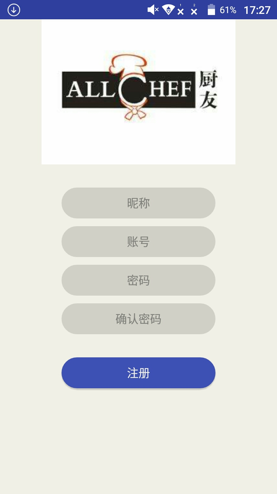
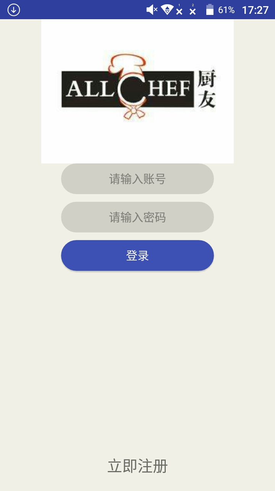
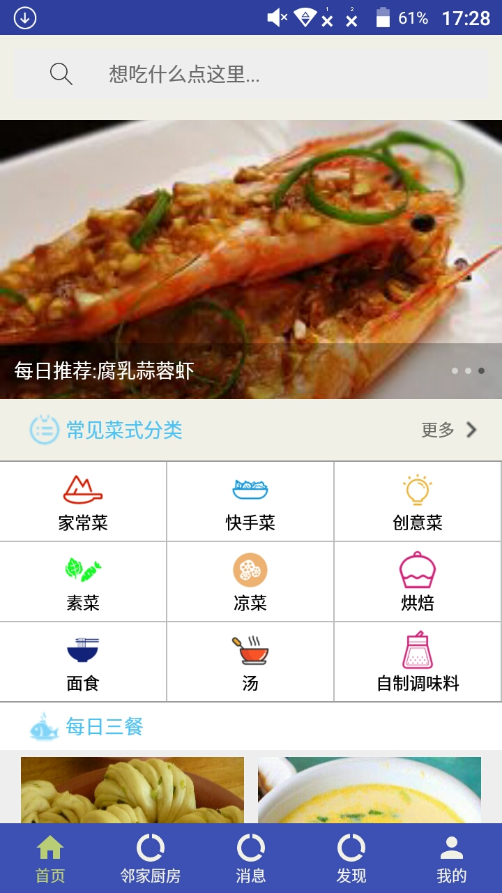
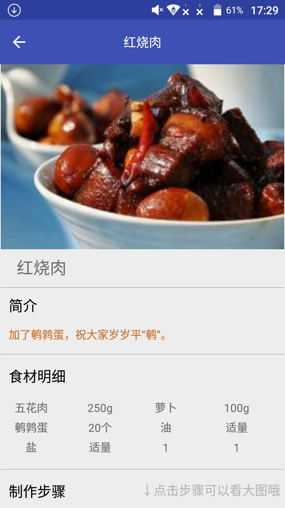
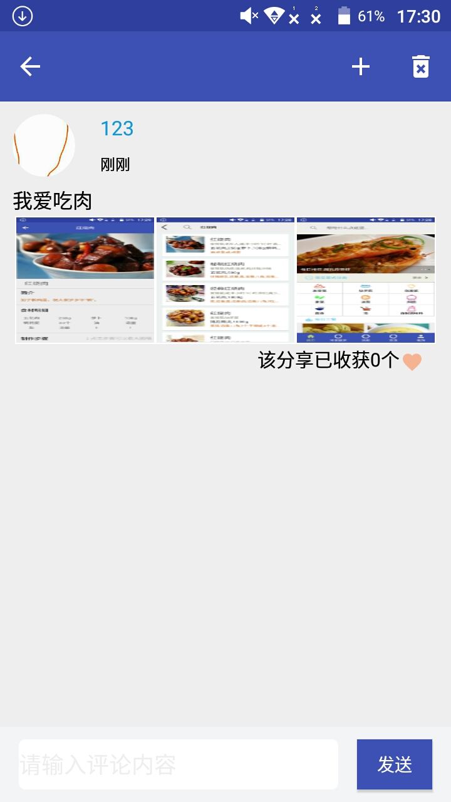

# 基于Android的美食交流平台——厨友CookFriends
该项目是我的毕业设计，一款基于Google Material Design设计开发的Android客户端。

## 功能模块介绍
登录注册模块：用户名+密码进行注册和登录，数据存储在云后台和环信后台。 
食谱模块：数据来源于聚合数据，这一模块涉及到菜谱详情页，菜谱搜索页，菜谱分类页等一系列页面。 
社区模块：用户可在这一模块发布分享，查看分享详情，对分享的评论，点赞，删除这些功能。
好友模块：该模块包含添加好友，群组创建，聊天的实现。 
发现模块：主要包含查看热门内容，搜索帖子或者收藏夹的实现。 
个人模块：主要包含个人信息的修改，和查看个人的分享，收藏夹，喜欢。 

## 效果图展示

